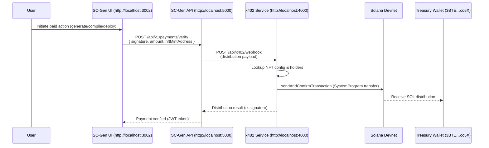

## SC-Gen → x402 → Solana Treasury Flow

This document explains the full devnet integration that wires the Smart Contract Generator (SC-Gen) through the x402 distribution engine to deliver on-chain revenue to a target Solana wallet. It includes the artefacts we touched, required configuration, and the runtime sequence now live in the local environment.

---

### 1. High-Level Overview

- **Mint Stage** – OASIS API mints an x402-enabled NFT (e.g. `MetaBrick x402 Devnet #2`) and transfers it to the treasury wallet (`3BTE…co5X`). The NFT’s metadata includes the x402 configuration.
- **Registration** – The x402 service records the mint address so future payments can be routed automatically.
- **SC-Gen Payment** – The SC-Gen API receives a payment verification request containing the Solana signature and the NFT mint address.
- **x402 Webhook** – SC-Gen forwards the payment details to the x402 webhook.
- **On-Chain Distribution** – The x402 service signs a real Solana transaction, applying platform fees and sending the net proceeds to the wallet(s) derived from current NFT holders.

---

### 2. Architecture Diagram



---

### 3. Component Responsibilities

| Component | Path / Entry Point | Key Updates |
|-----------|-------------------|-------------|
| **OASIS Minting** | `POST https://localhost:5004/api/nft/mint-nft` | Embed `metaData.x402` when minting NFTs destined for revenue sharing. |
| **x402 Service** | `x402/backend-service/src` | Loads signer (devnet keypair), calculates splits, builds & sends Solana transfers. |
| **SC-Gen API** | `SmartContractGenerator/src/SmartContractGen/ScGen.API` | Accepts `nftMintAddress` in `VerifyPaymentRequest` and routes to new webhook URL. |
| **Solana Devnet** | `https://api.devnet.solana.com` | Processes real transactions using the devnet mint wallet (`6rF4zz…Rijfv`). |

---

### 4. Runtime Configuration

| Service | Setting | Value |
|---------|---------|-------|
| x402 Service | `X402_USE_MOCK_DATA=false` | Enables real holder lookups and on-chain transfers. |
| x402 Service | `X402_SIGNER_SECRET=45BiYK…Da` | Base58 devnet signer used for outbound transfers (same wallet as the mint account). |
| SC-Gen API | `X402:DistributionWebhookUrl` | `http://localhost:4000/api/x402/webhook` |
| SC-Gen API | `VerifyPaymentRequest.nftMintAddress` | Mint address returned by OASIS minting (e.g. `6poPnTtvVSBeCb4SNydu6r8y8jye76nAQFqe9EtWpH69`). |

---

### 5. End-to-End Sequence

```mermaid
flowchart TD
    Mint[Mint NFT via OASIS<br/>SendToAddress=treasury] --> Register[Register NFT with x402 service]
    Register -->|stores| Config[x402-config.json]
    UserPayment[User pays for SC-Gen action<br/>(captures Solana tx signature)] --> Verify[POST /api/v1/payments/verify]
    Verify --> Webhook[SC-Gen → x402 webhook]
    Webhook --> Dist[x402 calculates split<br/>builds SystemProgram.transfer]
    Dist --> Chain[(Solana Devnet)]
    Chain --> TreasuryWallet[Treasury wallet receives SOL]
    Dist --> Ledger[x402 writes x402-distributions.json<br/>and exposes via /api/x402/history]
```

---

### 6. Example API Calls

1. **Mint & Deliver NFT**
    ```bash
    curl -k -s -X POST https://localhost:5004/api/nft/mint-nft \
      -H "Authorization: Bearer <jwt>" \
      -H "Content-Type: application/json" \
      -d '{
        "Title": "MetaBrick x402 Devnet #2",
        "SendToAddressAfterMinting": "3BTEJ9uANDQ5DqSZwmjQm2CsnGuofojBgViKRpVZco5X",
        "MetaData": { "x402": { "enabled": true, "distributionPercentage": 90, ... } },
        ...
      }'
    ```

2. **Register NFT with x402**
    ```bash
    curl -s -X POST http://localhost:4000/api/x402/register \
      -H "Content-Type: application/json" \
      -d '{ "nftMintAddress":"6poPnTtvVSBeCb4SNydu6r8y8jye76nAQFqe9EtWpH69",
             "paymentEndpoint":"http://localhost:4000/api/x402/webhook",
             "revenueModel":"equal_split",
             "treasuryWallet":"3BTEJ9uANDQ5DqSZwmjQm2CsnGuofojBgViKRpVZco5X" }'
    ```

3. **Verify Payment (SC-Gen)**
    ```bash
    curl -s -X POST http://localhost:5000/api/v1/payments/verify \
      -H "Content-Type: application/json" \
      -d '{
        "signature": "4D6NPhNn5aWstgM5sm7CsdB99pKh9Vyj2CPBPGgeH7NxkzxpXfDrNV18s1iEYVT8pAzJahfjM5H4wYbj8iX8i27o",
        "operation": "generate",
        "blockchain": "rust",
        "amount": 0.02,
        "nftMintAddress": "6poPnTtvVSBeCb4SNydu6r8y8jye76nAQFqe9EtWpH69"
      }'
    ```

4. **Inspect Distribution History**
    ```bash
    curl -s http://localhost:4000/api/x402/history/6poPnTtvVSBeCb4SNydu6r8y8jye76nAQFqe9EtWpH69
    ```

---

### 7. Verification Checklist

- [x] NFT minted with x402 metadata and delivered to the target wallet.
- [x] `x402/backend-service` running with `X402_SIGNER_SECRET`.
- [x] `ScGen.API` restarted so the webhook URL and request payload include `nftMintAddress`.
- [x] `GET /api/x402/history/<mint>` shows the distribution with a real Solana signature.
- [x] Solscan devnet transaction confirms the transfer (e.g. `3NgZ5xJb9zxpVJZdSYKH6...`).

---

### 8. Future Enhancements

- **Frontend wiring:** Pass the selected NFT mint address from the SC-Gen UI to `/api/v1/payments/verify`.
- **Multi-holder distributions:** Extend holder discovery to pull multiple owners via on-chain queries or the OASIS NFT API.
- **Configurability:** Externalise platform fee, distribution percentage, and treasury override per collection.

---

**Last tested:** 2025‑11‑09  

